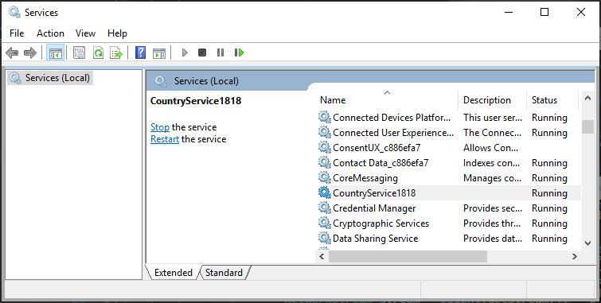
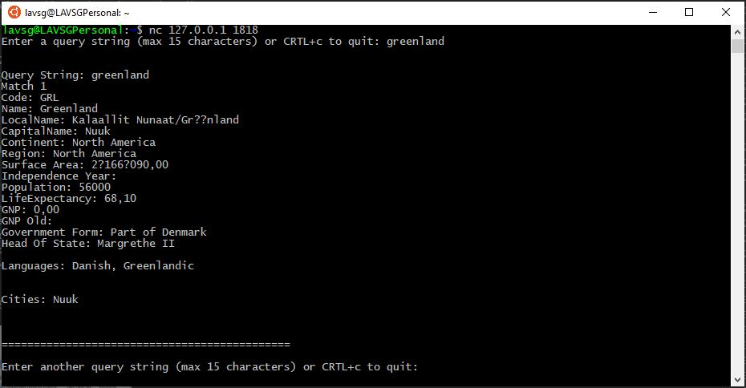

# Worker Service (targeting Windows, running as Windows Service)

In this section, the new Worker Service template in .NET Core 3.0 is tested. The worker service mainly aims at long running cross platform services. In this example, the worker service is used to run a TCP listener in a window service.

## Country Service 
For demonstration, the world database which comes with default MySQL community server is used as datasource. The data is converted into JSON format. However, the conversion from `latin1` to `utf8` is not taken care of. Hence there are issues for charset. The instance of `CountriesContext` is added as singleton while configuring services.

## Hosting as Windows Service
For suporting as windows service `.UseWindowsService()` needs to be added to the host. This requires adding reference to the NuGet package Microsoft.Extensions.Hosting.WindowsService package.

```
public static IHostBuilder CreateHostBuilder(string[] args) =>
            Host.CreateDefaultBuilder(args)
                .UseWindowsService()
                .ConfigureServices((hostContext, services) =>
                {
                    services.AddSingleton<CountriesContext>();
                    services.AddHostedService<Worker>();
                });
```

A Tcp Listener with IP address 127.0.0.1 and port 1818 is added. This listens to a query sting and seraches for matches with country name and country local name. For all matches, the country details are sent back.

## Creating the Service
The `sc` utility is used to create the service from the command prompt or power shell running as administrators. The command in this project generated from the post-build event as follows:
```
echo ======================================
echo In order to register the worker as a windows service
echo run the following command as admin from cmd or powershell:
echo sc create $(SolutionName) binPath=$(TargetDir)$(TargetName).exe
echo ======================================
```

The service "CountryService1818 (in this case)" is them manually stated in service manager services.msc




## Calling the listener in the service
I have used the `nc` utility in Ubuntu 18.04 LTS App to call the listener as shown below




