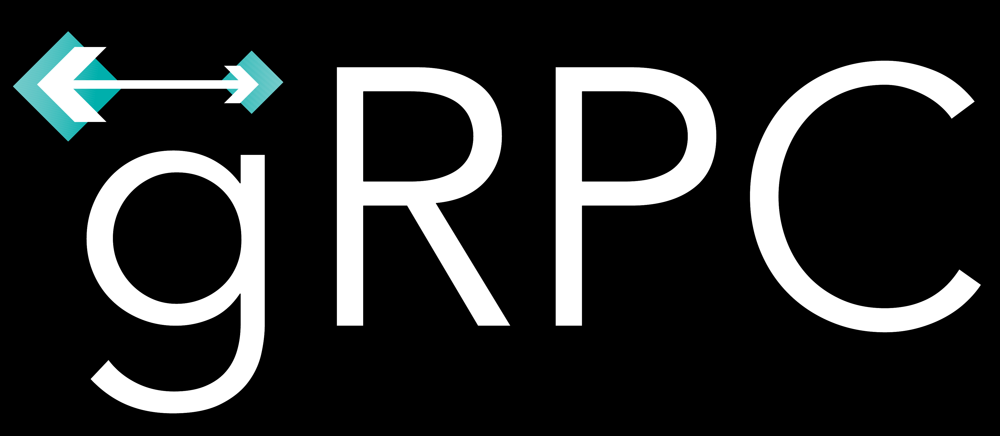

# gRPC in .NET CORE 3.0 Preview

## Protocol Buffers

### About
Protocol Buffers offer an extensible mechanism for serializing structured data and utilizing it across several platforms [1]. Currently the proto (proto3) definitions can be resolved in several languages including C#, Java, Pyth0n, C++, Objective-C, Dart, Go, Ruby etc.

Protocol Buffers have binary representation and generally have a smaller footprint compared to `JSON` or `XML` formats. Several advantages such as speed, compactness, pre defined schema, simple interoperability and relatively low boiler plate code. Validations and versioning support are inbuilt into the proto structure. These features make protocol buffers popular for micro services, especialy when the server application is not written in `JavaScript`.

proto3 version of prototype buffers support datatypes such as `double, float, int32, int64, uint32, uint64, sint32, sint64, fixed32, fixed64, sfixed32, sfixed64, bool, string and bytes`. The `protoc` compiles the `.proto` file and the types to corresponding types in the programming language of choice. Additionally `.proto` file can also contain Enumerations, Nested Types, repeated types (represents arrays) and maps (dictionaries). Keywords such as `reserved` are used to represent removed fields and are very handy for backward compatibility. The `.proto` files also support import, package directives for working across files and for namespaces.

Services (similar to controllers) and RPCs (similar to routes) are also defined in the `.proto` file and must be implemented in the programming language of choice.

### Example
Here is an example of a `.proto` file used in this application.

### Compiling `.proto` file

## DataSet
The [Chinook](https://github.com/lerocha/chinook-database) SQLite database is used in this demo project. The Entity Framework Core Tools (3.0..0-preview6) database approach is used for data modeling. The entity classes are created using:

`Scaffold-DbContext "Filename=Chinook_Sqlite.sqlite" Microsoft.EntityFrameworkCore.Sqlite`

The DateTime properties are mapped to `byte[]` during Scaffolding. They are parsed to DateTime using:

```
DateTime birthDay = DateTime.Parse(System.Text.Encoding.UTF8.GetString(employee.BirthDate));
Console.WriteLine($"{employee.FirstName}\t{birthDay.ToLongDateString()}");
```


## References
[1] Protocol Buffer Developer Guide https://developers.google.com/protocol-buffers/


