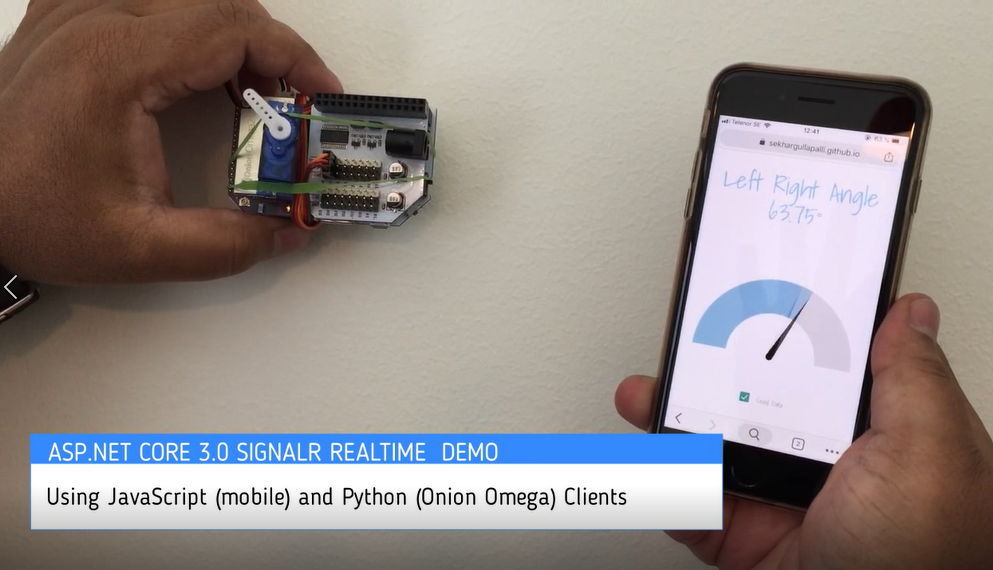

# Exploring SignalR in ASP.NET Core 3.0 Preview
A simple message hub is created using ASP.Net Core 3.0 SignalR APP which transmits a message (a floating point number here) in real time to the subscribed clients. A JavaScript client in opened in a mobile browser which sends the device orientation to the signalR app with a prescribed interval. 
In this project, I have used an [Onion Omega](https://onion.io/) board to demonstrate a Python 3 client which receives the device orientation from signalR App and converts it into a PWM signal which in turn controls a servo.

## Steps Involved

## Step 1: Deploy the SingalR App to Azure App Service
Additional steps are required to host the preview version (.net core 3.0) apps on Azure App Service. (as of August 3rd, 2019). I have deployed an empty app initially in free tier and added necassary extensions to support .net 3.0 Apps. The instructions are available [here](https://docs.microsoft.com/en-us/aspnet/core/host-and-deploy/azure-apps/?view=aspnetcore-2.2&tabs=visual-studio)

## Step 2: Develop the JavaScript Client
The JavaScript client is based on signalr.js (`npm install @microsoft/signalr`) and the client code example is available [here](https://docs.microsoft.com/en-us/aspnet/core/signalr/javascript-client?view=aspnetcore-3.0). I have used the `deviceorientation` event to capture the left right angle of the device and sent the value as a message to the hub.
The `html` page is then hosted on github pages for accessing through the mobile phone.
Note that cross-origin requests need to be enabled in the `Startup` class in the server app. Fi
```
services.AddCors(options => options.AddPolicy("CorsPolicy", 
            builder => 
            {
                builder.AllowAnyMethod().AllowAnyHeader()
                       .WithOrigins("https://[YOUR PROJECT].github.io")
                       .AllowCredentials();
            }));
```

## Step 3. Python Client on Onion Omega 2+
More on Onion Omega board, PWM libraries on Omega, installing Python3 and modules on this board can be read [here](https://onion.io/)
For communication with SignalR App, I have used `websocket_client` module. 
`pip install websocket_client`
For this to work with the ASP.Net Core SignalR App, the HttpsRedirection should be disabled. 
Also note that the WebSocketApp in Python client is initialized with a `wss` url and I have also set the SSL certificate requirement to none.


